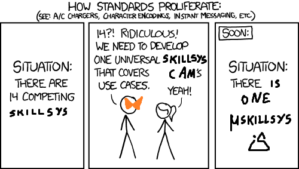

(if you are reading this, this repo is under-construction)

(thanks to Black Mage for the perfect summary of how this project came to be!)

## What is this?

**microskillsys** is an alternative skill system implementation for FE8. It was
initially written and designed for my [CELICA](https://github.com/CT075/celica-2024)
entry, but has since been reworked to be applicable more generally.

This project has two primary design goals:

- To provide a streamlined, uniform interface for writing new skills
- To be as compatible as possible with both existing and future engine mods by
  minimizing dependencies and hooks into vanilla code.

In comparison to the existing [FE8 Skill System](https://github.com/FireEmblemUniverse/SkillSystem_FE8),
(henceforth just "SkillSystem") which attempts to provide a "batteries included"
experience with many skills and extensions built-in, this project seeks instead
to expose a series of building blocks for users to craft their own skill system.

This project is intended for **expert users** proficient with make-based
EA buildfiles, specifically writing C functions to be linked in with `lyn`. By
design, this project comes with very few defaults, and an unmodified install
should not change vanilla behavior whatsoever (if you discover this not to be
the case, please file a bug report!).

## Why should I use microskillsys over SkillSystem?

- You don't need all of the machinery included with SkillSystem 1.x and would
  rather only include functionality that is strictly necessary.
- You intend to change some internals of the skill system itself (for example,
  using a custom implementation of `SkillTester` in SkillSystem 1.x).
- You would like to use another engine hack that is incompatible with SkillSystem
  1.x. Note that this project does not guarantee compatibility with other mods,
  but this project's simpler codebase should make it simpler to re-implement
  those mods in a compatible way.

## Why *shouldn't* I use microskillsys?

At the time of this writing, microskillsys is **feature incomplete**. While
full feature parity with SkillSystem is explicitly a non-goal of this project,
there are still many missing holes and hooks (for example, I have not yet worked
out a design for skill-based movement buffs).

- You are a beginner to FE8 engine hacking and intend to use many of the features
  or skills included with the default SkillSystem 1.x.
- You have an existing project using SkillSystem 1.x. There is no easy process
  for porting such a project to use this backend instead.
- You intend to have many "higher-order" skills that affect other skills, such
  as Nihil (from Radiant Dawn) or Rightful King (from Awakening). Due to the
  self-contained design of the skill interface (as opposed to SkillSystem's
  calc loops), implementing such skills is unwieldy but not impossible.
- Currently, microskillsys makes aggressive use of allocating and passing
  intermediate structs on the stack. These structs are relatively small and
  have short lifetimes, but it is possible that it will run into issues
  when combined with other stack-intensive modules.

Finally, this project is, at least for the moment, entirely developed and
maintained by me (Camdar). This means that, unlike the larger and
better-supported projects, microskillsys is going to be a lot slower to address
issues and resolve bugs. If this is a deal-breaker, you should look elsewhere.

## How can I use microskillsys in my project?

There are a few different modes, all of which are documented in
[quickstart.md](doc/quickstart.md).

## How can I contribute to this project?

See [CONTRIBUTING.md](CONTRIBUTING.md).

## Known bugs

This list is and will be inconsistently updated. For the most up-to-date info,
see the [issue tracker](https://github.com/CT075/microskillsys/issues).

- Opening the R-info window and pressing down with no skills or pressing right
  to move the info window off the rightmost skill will cause the info bubble
  to re-display itself rather than doing nothing.

## Technical details

Start with [HACKING.md](HACKING.md) and follow the related documentation links.

## Misc. FAQ

### What is the correct abbreviation for this project?

- The canonical rendering of the name of this project is `microskillsys` or
  `μskillsys` (that is a greek letter mu), in all lowercase. This suggests a
  few different possible abbreviations:

  - mss
  - μss
  - uss
  - muss (mu-skillsystem, so mu-ss)

  Feel free to use any of these, or any other zany one like BONEWALKER-SWORD
  that tickles your fancy.

### Why does this project exist over improving one of the existing skill systems?

- Aside from the differing design goals, I thought it would be a good exercise
  to write a skill system from scratch, and microskillsys is the result.
